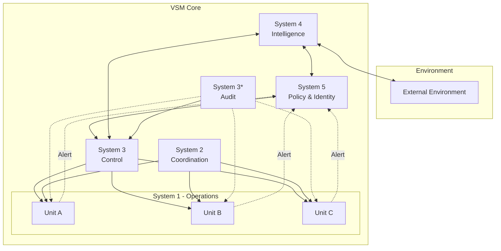

# VSM Core

The core implementation of the Viable System Model (VSM) in Elixir. This package provides the fundamental building blocks and coordination mechanisms for implementing Stafford Beer's cybernetic management framework.

## 🎯 Overview

VSM Core is the foundational package in the Viable Systems ecosystem, implementing Stafford Beer's cybernetic principles for organizational viability. It provides a complete, production-ready implementation of the VSM framework with advanced features for modern distributed systems.

### Key Features

- **🏗️ S1-S5 Subsystem Implementations**: Complete implementations of all five VSM subsystems with OTP supervision
- **📡 Advanced Channel Management**: Temporal Variety and Algedonic channels for sophisticated communication
- **🔄 Coordination Mechanisms**: Anti-oscillatory controls and distributed state management
- **📊 Built-in Telemetry**: Comprehensive observability with Telemetry.Metrics integration
- **🔌 Extensible Architecture**: Plugin-based system for custom implementations
- **⚡ High Performance**: Optimized for concurrent operations with minimal overhead
- **🛡️ Fault Tolerant**: OTP-based supervision trees ensure system resilience

### VSM Principles

The Viable System Model is based on the principle that any viable system must have five essential subsystems:

1. **System 1 (Operations)**: The parts that do the actual work
2. **System 2 (Coordination)**: Anti-oscillatory mechanisms
3. **System 3 (Control)**: Operational management and resource allocation
4. **System 4 (Intelligence)**: Environmental scanning and adaptation
5. **System 5 (Policy)**: Identity, ethos, and ultimate authority

## 🏛️ Architecture

```
vsm-core/
├── lib/
│   ├── vsm_core.ex                    # Main API and entry point
│   ├── vsm_core/
│   │   ├── application.ex             # OTP Application supervisor
│   │   ├── system1/                   # Operations subsystem
│   │   │   ├── operations.ex          # Core operations logic
│   │   │   ├── unit.ex               # Operational units
│   │   │   ├── transaction.ex        # Transaction management
│   │   │   ├── metrics.ex            # Performance metrics
│   │   │   └── supervisor.ex         # S1 supervision tree
│   │   ├── system2/                   # Coordination subsystem
│   │   │   ├── coordination.ex       # Anti-oscillation logic
│   │   │   ├── balancer.ex           # Load balancing
│   │   │   └── scheduler.ex          # Task scheduling
│   │   ├── system3/                   # Control subsystem
│   │   │   ├── control.ex            # Control logic
│   │   │   ├── resources.ex          # Resource management
│   │   │   └── audit.ex              # Three-star operations
│   │   ├── system4/                   # Intelligence subsystem
│   │   │   ├── intelligence.ex       # Environmental scanning
│   │   │   ├── analytics.ex          # Data analysis
│   │   │   ├── forecasting.ex        # Predictive modeling
│   │   │   └── scanner.ex            # External monitoring
│   │   ├── system5/                   # Policy subsystem
│   │   │   ├── policy.ex             # Policy engine
│   │   │   ├── identity.ex           # System identity
│   │   │   ├── values.ex             # Core values
│   │   │   └── decisions.ex          # Strategic decisions
│   │   ├── channels/                  # Communication channels
│   │   │   ├── temporal_variety.ex    # Time-based variety management
│   │   │   ├── algedonic.ex          # Alert/pain signals
│   │   │   └── ...                   # Channel implementations
│   │   └── shared/                    # Common modules
│   │       ├── variety_engineering.ex # Variety calculations
│   │       ├── recursion.ex          # Recursive structures
│   │       └── ...                   # Shared utilities
│   └── mix/tasks/                     # Mix tasks for management
└── test/                              # Comprehensive test suite
```

### Architecture Diagram



## 📦 Installation

### Prerequisites

- Elixir 1.14 or higher
- Erlang/OTP 25 or higher
- Mix build tool

### Add to Your Project

Add `vsm_core` to your list of dependencies in `mix.exs`:

```elixir
def deps do
  [
    {:vsm_core, "~> 0.1.0"},
    # Optional: Add telemetry visualization
    {:vsm_telemetry, "~> 0.1.0", optional: true}
  ]
end
```

Then fetch dependencies:

```bash
mix deps.get
mix deps.compile
```

## 🚀 Quick Start

### Basic Usage

```elixir
# Start the VSM supervisor
{:ok, pid} = VSMCore.start_link(
  name: :my_vsm,
  config: [
    s1_units: 3,
    telemetry_enabled: true,
    algedonic_threshold: 0.8
  ]
)

# Access subsystems
operations = VSMCore.system(1)
coordination = VSMCore.system(2)
control = VSMCore.system(3)
intelligence = VSMCore.system(4)
policy = VSMCore.system(5)

# Subscribe to events
VSMCore.subscribe(:operations_update)
VSMCore.subscribe(:algedonic_alert)

# Send messages between subsystems
VSMCore.send_message(:system1, :system3, {:alert, "Resource constraint detected"})

# Query system state
state = VSMCore.get_state(:system3)
metrics = VSMCore.get_metrics(:system1)
```

### Advanced Example - Setting Up a Production System

```elixir
defmodule MyApp.VSMSupervisor do
  use Supervisor

  def start_link(opts) do
    Supervisor.start_link(__MODULE__, opts, name: __MODULE__)
  end

  def init(_opts) do
    children = [
      # Start VSM Core with custom configuration
      {VSMCore, [
        name: :production_vsm,
        config: [
          # System 1 configuration
          s1_units: System.schedulers_online(),
          s1_transaction_timeout: 5_000,
          
          # System 2 coordination
          s2_balancing_interval: 1_000,
          s2_anti_oscillation: true,
          
          # System 3 control
          s3_resource_limits: %{
            cpu: 0.8,
            memory: 0.9,
            connections: 1000
          },
          
          # System 4 intelligence
          s4_scan_interval: 30_000,
          s4_forecast_window: :timer.hours(24),
          
          # System 5 policy
          s5_decision_timeout: 10_000,
          s5_consensus_required: true,
          
          # Channel configuration
          temporal_variety_enabled: true,
          algedonic_enabled: true,
          algedonic_threshold: 0.75,
          
          # Telemetry
          telemetry_enabled: true,
          telemetry_reporters: [:console, :prometheus]
        ]
      ]},
      
      # Your application components
      MyApp.Worker,
      MyApp.Monitor
    ]

    Supervisor.init(children, strategy: :one_for_one)
  end
end
```

## 📖 Subsystems in Detail

### System 1: Operations 🏭

The operational heart of the VSM, handling primary activities:

```elixir
# Create operational units
{:ok, unit} = VSMCore.System1.create_unit(%{
  name: "OrderProcessing",
  capacity: 100,
  resources: [:worker_pool, :database]
})

# Execute transactions
{:ok, result} = VSMCore.System1.execute_transaction(unit, %{
  type: :process_order,
  data: %{order_id: "123", items: [...]}
})

# Monitor performance
metrics = VSMCore.System1.get_metrics(unit)
# => %{throughput: 85.5, latency_p99: 234, error_rate: 0.001}
```

### System 2: Coordination 🔄

Anti-oscillatory mechanisms preventing conflicts:

```elixir
# Register coordination rules
VSMCore.System2.add_rule(%{
  name: "ResourceSharing",
  units: [:unit_a, :unit_b],
  type: :mutual_exclusion,
  resource: :shared_database
})

# Check for oscillations
oscillations = VSMCore.System2.detect_oscillations()

# Apply dampening
VSMCore.System2.apply_dampening(:aggressive)
```

### System 3: Control 🎛️

Operational management and resource allocation:

```elixir
# Allocate resources
VSMCore.System3.allocate_resources(%{
  unit_a: %{cpu: 0.4, memory: 0.3},
  unit_b: %{cpu: 0.3, memory: 0.4},
  unit_c: %{cpu: 0.3, memory: 0.3}
})

# Perform audit (System 3*)
audit_results = VSMCore.System3.audit_operations()

# Optimize performance
VSMCore.System3.optimize_allocation(
  strategy: :balanced,
  constraints: [:memory_limit, :latency_target]
)
```

### System 4: Intelligence 🔮

Environmental scanning and future planning:

```elixir
# Scan environment
trends = VSMCore.System4.scan_environment([
  :market_conditions,
  :competitor_analysis,
  :technology_trends
])

# Generate forecasts
forecast = VSMCore.System4.forecast(
  horizon: :days_30,
  models: [:arima, :neural_network]
)

# Propose adaptations
proposals = VSMCore.System4.propose_adaptations(trends, forecast)
```

### System 5: Policy 👑

Ultimate authority and identity:

```elixir
# Set organizational values
VSMCore.System5.set_values(%{
  core_values: [:reliability, :innovation, :sustainability],
  mission: "Deliver exceptional service",
  vision: "Industry leader by 2030"
})

# Make strategic decisions
decision = VSMCore.System5.decide(%{
  issue: :market_expansion,
  options: [:asia, :europe, :americas],
  criteria: [:roi, :risk, :alignment]
})

# Resolve S3-S4 conflicts
resolution = VSMCore.System5.resolve_conflict(
  s3_position: :optimize_current,
  s4_position: :invest_future
)
```

## 🛠️ Advanced Features

### Temporal Variety Channel

Manages variety over time with sophisticated pattern detection:

```elixir
# Configure temporal analysis
VSMCore.Channels.TemporalVariety.configure(%{
  timescales: [:minute, :hour, :day, :week],
  aggregation_methods: [:mean, :max, :percentile_95],
  pattern_detection: true
})

# Analyze temporal patterns
patterns = VSMCore.Channels.TemporalVariety.analyze_patterns(
  timeframe: :last_7_days,
  metrics: [:throughput, :latency, :errors]
)

# Visualize variety over time
chart = VSMCore.Channels.TemporalVariety.visualize(
  metric: :variety_ratio,
  period: :last_24_hours
)
```

### Algedonic Channel

Critical alert system bypassing normal hierarchy:

```elixir
# Configure alerting
VSMCore.Channels.Algedonic.configure(%{
  thresholds: %{
    critical: 0.9,
    severe: 0.75,
    warning: 0.6
  },
  routing: %{
    critical: [:system5, :operations_team],
    severe: [:system3, :system5],
    warning: [:system3]
  }
})

# Trigger alert
VSMCore.Channels.Algedonic.alert(%{
  severity: :critical,
  source: :system1_unit_a,
  message: "Database connection pool exhausted",
  metrics: %{pool_usage: 1.0, waiting_requests: 150}
})

# Query alert history
alerts = VSMCore.Channels.Algedonic.history(
  severity: :critical,
  last: :hours_24
)
```

### Variety Engineering

Sophisticated variety calculations based on Ashby's Law:

```elixir
# Calculate requisite variety
requisite = VSMCore.VarietyEngineering.calculate_requisite_variety(
  disturbances: 1000,
  environmental_states: 50
)

# Design attenuators
attenuators = VSMCore.VarietyEngineering.design_attenuators(
  input_variety: 10_000,
  target_variety: 100,
  methods: [:categorization, :filtering, :aggregation]
)

# Design amplifiers
amplifiers = VSMCore.VarietyEngineering.design_amplifiers(
  input_variety: 10,
  target_variety: 1_000,
  methods: [:automation, :delegation, :replication]
)
```

## 📊 Monitoring and Observability

### Built-in Telemetry

VSM Core emits detailed telemetry events:

```elixir
# Attach handlers
:telemetry.attach_many(
  "vsm-metrics",
  [
    [:vsm_core, :system1, :transaction, :stop],
    [:vsm_core, :system3, :resource_allocation],
    [:vsm_core, :system4, :forecast_generated],
    [:vsm_core, :algedonic, :alert]
  ],
  &handle_event/4,
  nil
)

# Custom metrics
VSMCore.Telemetry.track_metric(
  [:custom, :business_metric],
  %{value: 42.5, unit: :orders_per_second}
)
```

### Metrics Export

```elixir
# Export to Prometheus
VSMCore.Metrics.export(:prometheus, [
  port: 9568,
  path: "/metrics"
])

# Export to StatsD
VSMCore.Metrics.export(:statsd, [
  host: "localhost",
  port: 8125,
  prefix: "vsm"
])
```

## ⚙️ Configuration

### Complete Configuration Reference

```elixir
config :vsm_core,
  # Core settings
  name: :vsm_system,
  
  # System 1 - Operations
  s1_units: 5,
  s1_unit_supervision: :permanent,
  s1_transaction_timeout: 5_000,
  s1_metrics_interval: 1_000,
  
  # System 2 - Coordination  
  s2_enabled: true,
  s2_anti_oscillation: true,
  s2_balancing_interval: 500,
  s2_coordination_strategy: :adaptive,
  
  # System 3 - Control
  s3_resource_allocation: :dynamic,
  s3_optimization_interval: 10_000,
  s3_audit_enabled: true,
  s3_audit_interval: 60_000,
  
  # System 4 - Intelligence
  s4_scanning_enabled: true,
  s4_scan_interval: 30_000,
  s4_forecasting_enabled: true,
  s4_forecast_models: [:arima, :exponential_smoothing],
  s4_adaptation_threshold: 0.7,
  
  # System 5 - Policy
  s5_consensus_mechanism: :quorum,
  s5_decision_timeout: 10_000,
  s5_value_alignment_check: true,
  
  # Channels
  temporal_variety_enabled: true,
  temporal_variety_retention: :days_30,
  algedonic_enabled: true,
  algedonic_threshold: 0.8,
  algedonic_cooldown: 300_000,
  
  # Telemetry and Monitoring
  telemetry_enabled: true,
  telemetry_level: :detailed,
  metrics_export: [:console, :prometheus],
  
  # Performance
  pool_size: System.schedulers_online() * 2,
  max_overflow: 10,
  
  # Persistence
  persistence_adapter: :ets,
  persistence_options: [
    table_type: :set,
    read_concurrency: true
  ]
```

## 🤝 Integration with Other VSM Packages

VSM Core seamlessly integrates with the entire Viable Systems ecosystem:

- **[vsm_starter](../vsm-starter)**: Quick project scaffolding and templates
- **[vsm_telemetry](../vsm-telemetry)**: Advanced monitoring and visualization dashboards
- **[vsm_rate_limiter](../vsm-rate-limiter)**: Sophisticated rate limiting for algedonic signals
- **[vsm_goldrush](../vsm-goldrush)**: Event sourcing and complex event processing

Example integration:

```elixir
# In your mix.exs
def deps do
  [
    {:vsm_core, "~> 0.1.0"},
    {:vsm_telemetry, "~> 0.1.0"},
    {:vsm_rate_limiter, "~> 0.1.0"},
    {:vsm_goldrush, "~> 0.1.0"}
  ]
end

# In your application
children = [
  VSMCore,
  {VSMTelemetry, vsm: VSMCore},
  {VSMRateLimiter, channels: [:algedonic]},
  {VSMGoldrush, source: VSMCore}
]
```

## 🔍 Troubleshooting

Common issues and solutions:

1. **High memory usage**: Enable variety attenuation in System 2
2. **Algedonic alert storms**: Configure rate limiting and cooldown periods
3. **S3-S4 conflicts**: Ensure System 5 policies are clearly defined
4. **Performance degradation**: Check temporal variety patterns for anomalies

See [docs/TROUBLESHOOTING.md](docs/TROUBLESHOOTING.md) for detailed guides.

## 📚 Further Reading

- [User Guide](docs/USER_GUIDE.md) - Comprehensive usage documentation
- [API Reference](docs/API_REFERENCE.md) - Complete API documentation
- [Development Guide](docs/DEVELOPMENT.md) - Contributing and development setup
- [Architecture Decisions](docs/ARCHITECTURE_DESIGN.md) - Design rationale

## 🤝 Contributing

We welcome contributions! Please see [CONTRIBUTING.md](../vsm-docs/CONTRIBUTING.md) for guidelines.

## 📜 License

MIT License - see [LICENSE](LICENSE) file for details.

## 🙏 Acknowledgments

- Stafford Beer for the Viable System Model
- The Elixir community for excellent tools and libraries
- Contributors and users of the VSM Core project

---

Built with ❤️ by the Viable Systems team